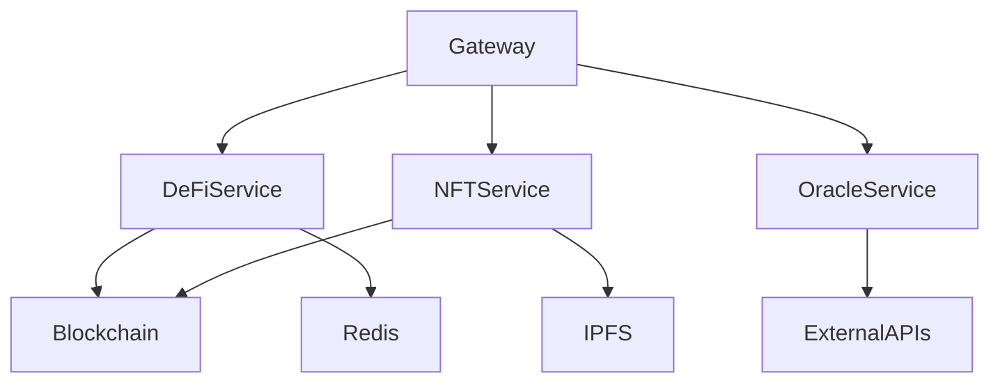

# isA_Chain 架构文档

## 概述

本目录包含 isA_Chain 生态系统的架构设计文档和技术规范。

## 文档索引

### 核心架构文档

1. **[混合服务架构设计规范](./hybrid-service-architecture.md)**
   - 三层架构设计
   - 服务端口分配
   - API设计规范
   - 部署架构
   - 监控与可观测性

2. **[服务实施指南](./service-implementation-guide.md)**
   - 快速开始指南
   - 服务模板使用
   - 合约集成示例
   - 测试策略
   - 部署准备

3. **[区块链集成架构](../BLOCKCHAIN_INTEGRATION_ARCHITECTURE.md)**
   - 代币经济系统
   - 智能合约集成
   - DeFi协议设计
   - NFT系统架构

## 架构概览

### 系统架构图

```
┌─────────────────────────────────────────────────────────┐
│                    用户层 (Web/Mobile/API)              │
└─────────────────────────────────────────────────────────┘
                             │
┌─────────────────────────────────────────────────────────┐
│                    Gateway层 (8000)                     │
│              路由 | 认证 | 限流 | 监控                    │
└─────────────────────────────────────────────────────────┘
                             │
┌─────────────────────────────────────────────────────────┐
│                 服务发现层 (Consul)                      │
└─────────────────────────────────────────────────────────┘
                             │
┌─────────────────────────────────────────────────────────┐
│                    微服务层                              │
│  ┌─────┐ ┌─────┐ ┌─────┐ ┌─────┐ ┌─────┐ ┌─────┐    │
│  │DeFi │ │NFT  │ │Oracle│ │Privacy│ │Tools│ │Exchange│ │
│  └─────┘ └─────┘ └─────┘ └─────┘ └─────┘ └─────┘    │
└─────────────────────────────────────────────────────────┘
                             │
┌─────────────────────────────────────────────────────────┐
│                 区块链层 (Smart Contracts)              │
│     ISAToken | SimpleDEX | ISANFT | StakingPool ...     │
└─────────────────────────────────────────────────────────┘
```

### 技术栈

| 层次 | 技术栈 | 用途 |
|------|--------|------|
| 前端 | Next.js, React, TypeScript | Web3 DApp界面 |
| Gateway | Go, Gin, Consul | API网关和服务发现 |
| 微服务 | Node.js, Express, TypeScript | 业务逻辑处理 |
| 区块链 | Solidity, Hardhat, Ethers.js | 智能合约和交互 |
| 基础设施 | Docker, K8s, Prometheus | 容器化和监控 |

## 设计原则

### 1. 微服务架构原则

- **单一职责**: 每个服务负责一个业务域
- **自治性**: 服务独立部署、扩展、更新
- **去中心化**: 分布式数据管理和决策
- **容错性**: 故障隔离，优雅降级
- **可观测性**: 完整的日志、指标、追踪

### 2. API设计原则

- **RESTful**: 遵循REST架构风格
- **版本控制**: 支持多版本共存
- **幂等性**: 支持安全重试
- **分页**: 大数据集分页返回
- **错误处理**: 统一错误格式

### 3. 安全原则

- **零信任**: 每个请求都需要验证
- **最小权限**: 仅授予必要权限
- **加密传输**: HTTPS/TLS加密
- **密钥管理**: 安全的密钥存储
- **审计日志**: 完整的操作记录

## 服务清单

### 核心服务

| 服务名 | 端口 | 状态 | 描述 |
|--------|------|------|------|
| gateway | 8000 | ✅ 已实现 | API网关 |
| defi-service | 8311 | ✅ 已实现 | DeFi操作 |
| nft-service | 8312 | 🚧 开发中 | NFT管理 |
| oracle-service | 8313 | 📋 计划中 | 预言机服务 |
| privacy-service | 8314 | 📋 计划中 | 隐私交易 |
| tools-service | 8315 | 📋 计划中 | 开发工具 |
| exchange-service | 8316 | 📋 计划中 | 交易所功能 |

### 支撑服务

| 服务名 | 端口 | 描述 |
|--------|------|------|
| consul | 8500 | 服务发现与配置 |
| prometheus | 9090 | 指标收集 |
| grafana | 3000 | 监控可视化 |
| elasticsearch | 9200 | 日志存储 |
| redis | 6379 | 缓存服务 |

## 开发流程

### 1. 新服务开发流程


### 2. 服务依赖关系



## 部署策略

### 开发环境

```bash
# 本地开发
docker-compose -f docker-compose.dev.yml up

# 访问服务
http://localhost:8000  # Gateway
http://localhost:8311  # DeFi Service
http://localhost:8500  # Consul UI
```

### 测试环境

```bash
# 部署到测试环境
kubectl apply -f k8s/test/

# 运行测试
npm run test:e2e
```

### 生产环境

```bash
# 蓝绿部署
./scripts/deploy-production.sh --strategy blue-green

# 金丝雀发布
./scripts/deploy-production.sh --strategy canary --percentage 10
```

## 监控与告警

### 关键指标

| 指标 | 阈值 | 告警级别 |
|------|------|----------|
| 服务可用性 | < 99.9% | Critical |
| API延迟 P99 | > 1s | Warning |
| 错误率 | > 1% | Warning |
| CPU使用率 | > 80% | Warning |
| 内存使用率 | > 90% | Critical |

### 日志级别

| 级别 | 使用场景 |
|------|----------|
| ERROR | 系统错误，需要立即处理 |
| WARN | 潜在问题，需要关注 |
| INFO | 重要业务事件 |
| DEBUG | 调试信息 |
| TRACE | 详细追踪信息 |

## 故障处理

### 1. 服务降级策略

```typescript
// 断路器模式
const circuitBreaker = new CircuitBreaker({
  timeout: 3000,
  errorThreshold: 50,
  resetTimeout: 30000
});

// 降级处理
try {
  result = await circuitBreaker.call(serviceCall);
} catch (error) {
  result = await fallbackService();
}
```

### 2. 灾难恢复

- **RTO (Recovery Time Objective)**: < 1小时
- **RPO (Recovery Point Objective)**: < 15分钟
- **备份策略**: 每日全量 + 每小时增量
- **多区域部署**: 主备双活架构

## 性能基准

### API性能目标

| 操作 | 目标延迟 | 吞吐量 |
|------|---------|---------|
| 读取操作 | < 100ms | 10000 RPS |
| 写入操作 | < 500ms | 1000 RPS |
| 查询操作 | < 200ms | 5000 RPS |
| 批量操作 | < 2s | 100 RPS |

### 区块链交互性能

| 操作 | 目标时间 |
|------|---------|
| 读取合约状态 | < 50ms |
| 发送交易 | < 3s |
| 等待确认 (1 confirmation) | < 15s |
| 等待确认 (12 confirmations) | < 3min |

## 安全审计清单

- [ ] 代码安全扫描
- [ ] 依赖漏洞检查
- [ ] 容器镜像扫描
- [ ] API渗透测试
- [ ] 智能合约审计
- [ ] 访问控制验证
- [ ] 数据加密验证
- [ ] 日志脱敏检查

## 相关资源

### 内部文档

- [API参考文档](../api-reference/api.md)
- [智能合约文档](../../contracts/README.md)
- [部署指南](../deployment/README.md)

### 外部资源

- [Ethereum文档](https://ethereum.org/developers)
- [OpenZeppelin合约库](https://docs.openzeppelin.com)
- [Docker文档](https://docs.docker.com)
- [Kubernetes文档](https://kubernetes.io/docs)

## 联系方式

- **架构团队**: architecture@isa-chain.io
- **DevOps团队**: devops@isa-chain.io
- **安全团队**: security@isa-chain.io

## 更新日志

| 日期 | 版本 | 更新内容 |
|------|------|----------|
| 2024-01-15 | 1.0.0 | 初始架构设计 |
| 2024-01-20 | 1.1.0 | 添加DeFi服务 |
| 2024-01-22 | 1.2.0 | 完善监控方案 |

---

*本文档持续更新中，最后更新时间: 2024-01-22*