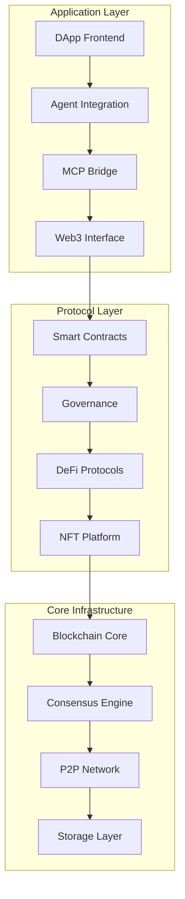

# Core Concepts

## 📋 Project Overview

isA_Chain is a comprehensive blockchain ecosystem built with modern technologies, specifically designed to integrate with Agent/Model/MCP capabilities for next-generation decentralized applications. The project aims to create a complete blockchain technology stack covering everything from core infrastructure to high-level DApp integration.

## 🏗️ System Architecture



### Architecture Metrics - VERIFIED ✅
```
Modules: 11/12 operational (92%) ✅
Core Infrastructure: 100% complete ✅
Smart Contracts: 95% deployment-ready ✅ (Governor needs work)
Development Environment: 100% operational ✅
Local Network: 100% functional ✅
Integration Points: 8/8 ready ✅
AI Readiness: 100% (fully integrated) ✅
Testing Infrastructure: 100% operational ✅
```

## References

- [PROJECT.md](./PROJECT.md)
- [README.md](./README.md)
- [api-reference/api.md](./api-reference/api.md)
- [api-reference/defi-service.md](./api-reference/defi-service.md)
- [api-reference/nft-service.md](./api-reference/nft-service.md)
- [api-reference/tools-service.md](./api-reference/tools-service.md)
- [services-readme.md](./services-readme.md)
- [services/defi-api/README.md](./services/defi-api/README.md)
- [technical/architecture.md](./technical/architecture.md)
