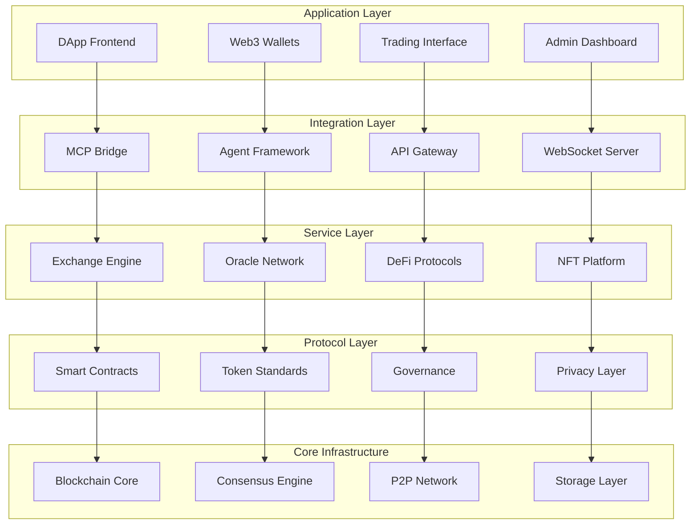
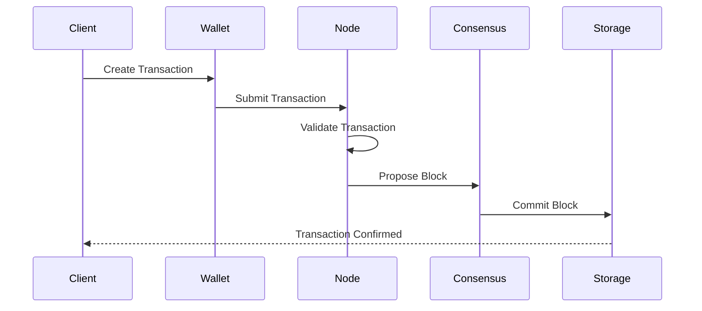

# 🏗️ isA_Chain Architecture Overview

## System Architecture

isA_Chain is designed as a modular, scalable blockchain ecosystem with AI-native capabilities. The architecture follows a layered approach with clear separation of concerns.



## Core Components

### 1. 🧱 Core Infrastructure

#### Blockchain Core (`core/blockchain/`)
- **Block Production**: Efficient block creation and validation
- **Transaction Pool**: Mempool management with priority ordering
- **State Management**: Account and contract state handling
- **Fork Choice**: Canonical chain selection algorithm

#### Consensus Engine (`core/consensus/`)
- **Proof-of-Stake**: Modern PoS with slashing conditions
- **Validator Management**: Stake management and validator rotation
- **Finality**: Fast finality with Byzantine fault tolerance
- **Cross-chain**: Bridge consensus for interoperability

#### P2P Network (`core/network/`)
- **Discovery**: Peer discovery and bootstrapping
- **Gossip Protocol**: Efficient message propagation
- **Sync Protocol**: Fast and secure blockchain synchronization
- **Sharding**: Network partitioning for scalability

#### Storage Layer (`core/storage/`)
- **State Database**: Merkle Patricia Trie for state
- **Block Storage**: Optimized block and transaction storage
- **Archive Node**: Historical data retention
- **Pruning**: State pruning for reduced storage

### 2. 💼 Wallet System

#### Multi-Platform Support
```
wallet/
├── core/           # Shared wallet logic
├── web/           # Browser extension wallet
├── mobile/        # React Native mobile app
└── hardware/      # Hardware wallet integration
```

#### Key Features
- **HD Wallets**: BIP32/BIP44 hierarchical deterministic wallets
- **Multi-Signature**: M-of-N multisig support
- **Hardware Security**: Ledger, Trezor integration
- **Social Recovery**: Account recovery mechanisms

### 3. 📜 Smart Contract Framework

#### Multi-Language Support
```
contracts/
├── solidity/      # Ethereum-compatible contracts
├── rust/          # High-performance Rust contracts
├── templates/     # Ready-to-use contract templates
└── tools/         # Development and deployment tools
```

#### Contract Features
- **Gas Optimization**: Efficient execution environment
- **Upgradability**: Proxy patterns and upgrade mechanisms
- **Security**: Built-in security checks and auditing
- **Interoperability**: Cross-chain contract calls

### 4. 🏦 DeFi Protocols

#### Decentralized Exchange (`defi/dex/`)
```rust
// Example DEX core functionality
pub struct DEX {
    pools: HashMap<PoolId, LiquidityPool>,
    orders: OrderBook,
    router: SwapRouter,
}

impl DEX {
    pub async fn swap(&mut self, params: SwapParams) -> Result<SwapResult, DexError> {
        // Optimal routing algorithm
        let route = self.router.find_optimal_route(&params)?;
        self.execute_swap(route).await
    }
}
```

#### Staking Protocol (`defi/staking/`)
- **Liquid Staking**: Tokenized staking derivatives
- **Validator Delegation**: Decentralized validator selection
- **Rewards Distribution**: Automated staking rewards
- **Slashing Protection**: Risk mitigation strategies

#### Lending Protocol (`defi/lending/`)
- **Overcollateralized Loans**: Secure lending with collateral
- **Interest Rate Models**: Dynamic interest rate curves
- **Liquidation Engine**: Automated liquidation system
- **Flash Loans**: Uncollateralized instant loans

### 5. 🤖 AI Integration

#### MCP Bridge (`ai-integration/mcp-bridge/`)
```typescript
// MCP integration for blockchain operations
export class BlockchainMCP {
  async executeSmartContract(params: ContractParams): Promise<ContractResult> {
    const contract = await this.loadContract(params.address);
    return await contract.call(params.method, params.args);
  }

  async analyzeTransaction(txHash: string): Promise<TransactionAnalysis> {
    const tx = await this.getTransaction(txHash);
    return this.aiAnalyzer.analyze(tx);
  }
}
```

#### Agent Framework (`ai-integration/agent-framework/`)
- **Trading Agents**: Automated trading strategies
- **Risk Management**: AI-powered risk assessment
- **Market Making**: Intelligent liquidity provision
- **Governance Participation**: Automated proposal voting

### 6. 🔐 Privacy & Security

#### Zero-Knowledge Proofs (`privacy/zero-knowledge/`)
```rust
// ZK-SNARK implementation for private transactions
pub struct PrivateTransaction {
    nullifier: [u8; 32],
    commitment: [u8; 32],
    proof: ZkProof,
}

impl PrivateTransaction {
    pub fn verify(&self) -> bool {
        verify_proof(&self.proof, &self.commitment, &self.nullifier)
    }
}
```

#### Privacy Features
- **Anonymous Transactions**: Ring signatures and mixing
- **Private Smart Contracts**: Confidential contract execution
- **Encrypted Messaging**: Secure communication layer
- **Metadata Protection**: Transaction graph obfuscation

### 7. 🔮 Oracle Network

#### Decentralized Oracles (`oracle/`)
- **Price Feeds**: Real-time asset pricing
- **External Data**: Weather, sports, events
- **Cross-chain Data**: Inter-blockchain communication
- **Verifiable Randomness**: Secure random number generation

## Data Flow

### Transaction Lifecycle


### Smart Contract Execution
1. **Transaction Received**: Node receives contract call
2. **State Loading**: Load contract state from storage
3. **VM Execution**: Execute contract in virtual machine
4. **State Changes**: Apply state modifications
5. **Event Emission**: Emit contract events
6. **State Commit**: Persist state changes

## Scalability Solutions

### Layer 2 Integration
- **State Channels**: Off-chain transaction processing
- **Rollups**: Optimistic and ZK rollups
- **Sidechains**: Independent chains with bridges
- **Sharding**: Horizontal scaling of the main chain

### Performance Optimizations
- **Parallel Execution**: Concurrent transaction processing
- **State Caching**: In-memory state for faster access
- **Compression**: Optimized data structures
- **Pruning**: Historical data management

## Security Model

### Consensus Security
- **Economic Security**: High cost of attack
- **Slashing Conditions**: Punishment for misbehavior
- **Randomness**: Unpredictable validator selection
- **Finality**: Irreversible transaction confirmation

### Smart Contract Security
- **Formal Verification**: Mathematical proof of correctness
- **Auditing Tools**: Automated vulnerability detection
- **Bug Bounties**: Community-driven security testing
- **Upgrade Mechanisms**: Safe contract upgrades

## Monitoring & Analytics

### System Metrics
- **Performance**: TPS, latency, throughput
- **Network**: Peer count, connectivity, bandwidth
- **Consensus**: Participation, finality time
- **Security**: Attack detection, anomaly monitoring

### Business Intelligence
- **DeFi Metrics**: TVL, volume, user activity
- **Token Analytics**: Supply, distribution, transfers
- **Governance**: Proposal activity, voting patterns
- **User Behavior**: Transaction patterns, adoption

## Deployment Architecture

### Production Environment
```yaml
# Kubernetes deployment example
apiVersion: apps/v1
kind: Deployment
metadata:
  name: blockchain-node
spec:
  replicas: 3
  selector:
    matchLabels:
      app: blockchain-node
  template:
    spec:
      containers:
      - name: blockchain-node
        image: isa-chain/node:latest
        ports:
        - containerPort: 8080
        - containerPort: 8545
```

### Microservices Architecture
- **API Gateway**: Request routing and rate limiting
- **Load Balancer**: Traffic distribution
- **Service Discovery**: Dynamic service registration
- **Circuit Breaker**: Fault tolerance patterns

---

This architecture provides a solid foundation for a comprehensive blockchain ecosystem while maintaining flexibility for future enhancements and integrations.